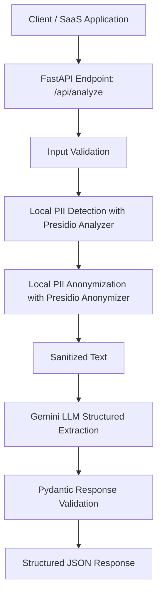

# Secure Enterprise NLP SaaS Pipeline

A privacy-aware NLP extraction API that locally anonymizes sensitive text before sending it to a cloud LLM for structured JSON analysis.

This project demonstrates how enterprise or healthcare-style text can be processed through a safer pipeline by applying a local PII masking layer before using an external AI model. It is designed as a backend prototype for SaaS applications that need to extract summaries, urgency levels, metrics, and action items from sensitive documents.

---

## Problem Statement

Many companies want to use large language models to analyze internal documents, customer requests, medical notes, claims, or operational reports. However, sending raw text directly to a public cloud LLM can create privacy and compliance risks if the text contains personally identifiable information, such as names, phone numbers, email addresses, IDs, or other sensitive details.

This project solves that problem by adding a local anonymization layer before the text reaches the LLM.

The pipeline:

1. Receives raw enterprise or healthcare-style text through an API.
2. Detects and anonymizes PII locally using Microsoft Presidio.
3. Sends only the sanitized text to Gemini.
4. Returns a strict structured JSON response validated with Pydantic.

---

## Key Features

* Local PII detection and anonymization using Microsoft Presidio.
* FastAPI backend with an asynchronous API endpoint.
* Gemini integration using the Google GenAI SDK.
* Structured JSON output using Gemini response schemas.
* Pydantic validation to enforce a strict response format.
* Error handling for empty input and pipeline failures.
* Swagger/OpenAPI documentation generated automatically by FastAPI.

---

## Tech Stack

* **Python**
* **FastAPI**
* **Pydantic**
* **Microsoft Presidio Analyzer**
* **Microsoft Presidio Anonymizer**
* **spaCy**
* **Google GenAI SDK**
* **Gemini**
* **Uvicorn**

---

## Architecture



---

## How It Works

The API accepts a text payload from the user. Before any data is sent to Gemini, the text is processed locally using Presidio.

For example, text such as:

```text
Patient Ahmed Hassan called from ahmed@example.com and reported severe chest pain.
```

may be anonymized into something like:

```text
Patient <PERSON> called from <EMAIL_ADDRESS> and reported severe chest pain.
```

Only the anonymized version is sent to the LLM.

Gemini then analyzes the sanitized content and returns structured JSON containing:

* Executive summary
* Urgency level
* Key metrics
* Action items

---

## Project Structure

```text
secure-nlp-saas-pipeline/
│
├── main.py              # FastAPI app, anonymization logic, and Gemini pipeline
├── requirements.txt     # Python dependencies
├── README.md            # Project documentation
├── .gitignore           # Files ignored by Git
```

---

## Setup Instructions

### 1. Clone the Repository

```bash
git clone https://github.com/RietalGharib/secure-nlp-saas-pipeline.git
cd secure-nlp-saas-pipeline
```

### 2. Create a Virtual Environment

```bash
python -m venv venv
```

Activate it:

For Windows:

For Windows:

```powershell
.\venv\Scripts\activate
```

For macOS/Linux:

```bash
source venv/bin/activate
```

### 3. Install Dependencies

```bash
pip install -r requirements.txt
```

### 4. Download the spaCy Language Model

```bash
python -m spacy download en_core_web_lg
```

### 5. Set Your Gemini API Key

For Windows PowerShell:

```bash
$env:GEMINI_API_KEY="your_api_key_here"
```

For macOS/Linux:

```bash
export GEMINI_API_KEY="your_api_key_here"
```

---

## Running the API

Start the FastAPI server:

```bash
uvicorn main:app --reload
```

The API will run locally at:

```text
http://127.0.0.1:8000
```

FastAPI Swagger documentation will be available at:

```text
http://127.0.0.1:8000/docs
```

---

## API Documentation

### POST `/api/analyze`

Analyzes a text document after locally anonymizing sensitive information.

### Request Body

```json
{
  "text": "Patient John Smith called from john.smith@example.com and reported severe chest pain after surgery on 12 March. The case should be reviewed urgently."
}
```

### Response Body

```json
{
  "summary": "The document describes a patient reporting severe chest pain after surgery. The case requires urgent medical or operational review.",
  "urgency_level": "HIGH",
  "key_metrics": [
    "12 March"
  ],
  "action_items": [
    "Review the reported chest pain case urgently",
    "Escalate the case to the appropriate medical or operations team"
  ]
}
```

---

## Response Schema

The API returns a structured response using the following schema:

```python
class AnalysisResponse(BaseModel):
    summary: str
    urgency_level: str
    key_metrics: List[str]
    action_items: List[str]
```

### Field Descriptions

| Field           | Description                                                  |
| --------------- | ------------------------------------------------------------ |
| `summary`       | A concise executive summary of the document                  |
| `urgency_level` | The detected urgency level: LOW, MEDIUM, HIGH, or CRITICAL   |
| `key_metrics`   | Important dates, quantities, numbers, or operational metrics |
| `action_items`  | Clear next steps extracted from the text                     |

---

## Example cURL Request

```bash
curl -X POST "http://127.0.0.1:8000/api/analyze" \
-H "Content-Type: application/json" \
-d "{\"text\":\"Patient John Smith called from john.smith@example.com and reported severe chest pain after surgery on 12 March. The case should be reviewed urgently.\"}"
```

---

## Security and Privacy Approach

This project uses a local masking layer to reduce the risk of sending sensitive information to a cloud LLM.

The security flow is:

1. Raw text enters the local API.
2. Presidio detects possible PII entities.
3. Presidio anonymizes the detected entities.
4. The sanitized version is sent to Gemini.
5. The response is validated before being returned to the client.

This makes the project suitable as a prototype for privacy-aware NLP workflows.

---

## Security Limitations

This project is a prototype and should not be described as fully GDPR-compliant or HIPAA-compliant without further controls.

Current limitations include:

* No user authentication or authorization.
* No audit logging.
* No encryption layer beyond standard local/runtime configuration.
* No role-based access control.
* No database or secure storage layer.
* No rate limiting.
* No production deployment configuration.
* PII detection may not catch every possible sensitive entity.
* Cloud LLM usage still requires careful review depending on organizational policy.

For production use, the project would need additional security controls, compliance review, logging, monitoring, access control, and deployment hardening.

---

## Future Improvements

Planned improvements could include:

* Add JWT authentication.
* Add Docker support.
* Add unit tests for anonymization and API responses.
* Add a `.env.example` file.
* Add request logging with sensitive-data-safe logs.
* Add rate limiting.
* Add support for batch document processing.
* Add a frontend dashboard.
* Store anonymization mappings securely when re-identification is required.
* Add deployment instructions for cloud or private infrastructure.

---

## Resume Description

**Secure Enterprise NLP SaaS Pipeline**
Built a FastAPI-based NLP pipeline that locally detects and anonymizes PII using Microsoft Presidio before sending sanitized text to Gemini for structured JSON analysis. Implemented Pydantic response validation, asynchronous API endpoints, and privacy-focused preprocessing for enterprise and healthcare-style text workflows.

---

## Disclaimer

This project is intended for educational and portfolio purposes. It demonstrates privacy-aware design patterns for NLP pipelines but is not a complete production compliance solution.
